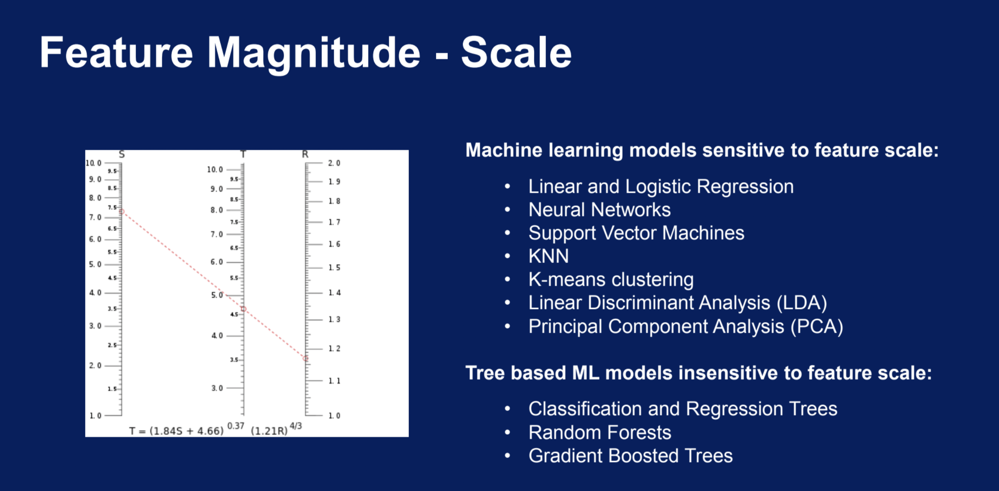

# Research Environment


# Feature Engineering





## Why Do We Select Features?
- Simple models are easier to interpret
- Shorter training times
- Enhanced generalisation by reducing overfitting
- Easier to implement by software developers → Model production
- Reduced risk of data errors during model use
- Data


## Reducing features for model deployment

- Smaller json messages sent over to the model
- Json messages contain only the necessary variables / inputs
- Less lines of code for error handling
- Error handlers need to be written for each variable / input
- Less information to log
- Less feature engineering code

# Feature Selection

Feature selection is a crucial step in the process of building machine learning models, especially when dealing with datasets that contain a large number of features. The goal of feature selection is to identify and choose the most relevant features that contribute the most to the predictive performance of the model, while discarding irrelevant or redundant ones. By doing so, feature selection helps to simplify the model, reduce overfitting, and improve its interpretability and computational efficiency.

There are several methods for feature selection, broadly categorized into three main types: filter methods, embedded methods, and wrapper methods.

1. **Filter Methods:**
   - Filter methods evaluate the relevance of features based on their statistical properties, such as correlation with the target variable or information gain. These methods are computationally less intensive compared to wrapper methods since they do not involve training the model.
   - Common techniques include:
     - Pearson correlation coefficient: Measures the linear correlation between two variables.
     - Mutual information: Measures the amount of information that one variable contains about another variable.
     - Chi-square test: Assesses the independence between categorical variables.
   - Filter methods are generally fast and scalable but may overlook feature interactions and dependencies.

2. **Embedded Methods:**
   - Embedded methods incorporate feature selection into the model training process itself. These methods select features based on their importance derived during the model training.
   - Techniques like regularization methods (e.g., Lasso, Ridge regression), decision trees (e.g., Random Forest), and gradient boosting algorithms (e.g., XGBoost, LightGBM) inherently perform feature selection as part of their training process by penalizing or pruning less important features.
   - Embedded methods are advantageous as they consider feature interactions and can effectively handle high-dimensional datasets. However, they require more computational resources compared to filter methods.

3. **Wrapper Methods:**
   - Wrapper methods select subsets of features based on their impact on the performance of a specific machine learning algorithm. These methods evaluate different subsets of features by training and testing the model with each subset.
   - Techniques like forward selection, backward elimination, and recursive feature elimination (RFE) fall under wrapper methods.
   - Wrapper methods are computationally expensive since they involve training the model multiple times for different feature subsets. However, they typically yield better performance compared to filter and embedded methods as they directly optimize the model's performance metric.
   - Wrapper methods are suitable for small to moderate-sized datasets where computational resources are not a limiting factor.

In summary, feature selection plays a crucial role in building effective machine learning models by identifying the most relevant features while discarding irrelevant ones. Filter methods are efficient but may overlook feature interactions, embedded methods incorporate feature selection into the model training process, and wrapper methods directly optimize the model's performance metric at the expense of higher computational cost. The choice of feature selection method depends on the specific characteristics of the dataset and the requirements of the model.

# Model Building

Model building is the process of creating a mathematical representation of a real-world system or phenomenon using data. These models can be used for prediction, classification, clustering, or gaining insights from the data. The choice of model depends on the nature of the problem, the characteristics of the data, and the goals of the analysis. Here are some common types of models used in machine learning and statistics:

1. **Linear Models:**
   - Linear models assume a linear relationship between the input features and the target variable. Examples include linear regression for continuous target variables and logistic regression for binary classification tasks.
   - Linear models are simple and interpretable, making them suitable for tasks where the relationship between variables is approximately linear.

2. **Tree-Based Models:**
   - Tree-based models, such as decision trees, random forests, and gradient boosting machines (GBM), partition the feature space into a hierarchy of decision rules.
   - These models are versatile and can capture complex nonlinear relationships in the data. They are widely used for both classification and regression tasks.

3. **Support Vector Machines (SVM):**
   - SVM is a supervised learning algorithm that constructs a hyperplane in a high-dimensional space to separate classes.
   - SVM is effective in high-dimensional spaces and is particularly well-suited for classification tasks with a clear margin of separation between classes.

4. **Neural Networks:**
   - Neural networks, inspired by the structure of the human brain, consist of interconnected layers of artificial neurons.
   - Deep learning models, which are neural networks with many hidden layers, have achieved state-of-the-art performance in various domains, including image recognition, natural language processing, and reinforcement learning.

5. **Instance-Based Models:**
   - Instance-based models, such as k-nearest neighbors (KNN), make predictions based on the similarity between new instances and existing data points.
   - These models are simple and easy to understand, but they can be computationally expensive, especially with large datasets.

6. **Ensemble Models:**
   - Ensemble models combine the predictions of multiple base models to improve performance.
   - Techniques like bagging (e.g., Random Forest), boosting (e.g., AdaBoost, XGBoost), and stacking are used to create ensemble models that are more robust and accurate than individual models.

7. **Clustering Models:**
   - Clustering models, such as k-means clustering and hierarchical clustering, group similar data points together based on their characteristics.
   - These models are unsupervised learning techniques used for exploratory data analysis, anomaly detection, and customer segmentation.

8. **Probabilistic Models:**
   - Probabilistic models, including naive Bayes, Gaussian mixture models, and hidden Markov models, model the uncertainty in the data using probabilistic distributions.
   - These models are useful for tasks where uncertainty needs to be explicitly modeled, such as text classification, speech recognition, and time series analysis.

Each type of model has its strengths and weaknesses, and the choice of model depends on factors such as the complexity of the data, the interpretability of the model, the computational resources available, and the specific goals of the analysis. In practice, it is often beneficial to experiment with multiple types of models and compare their performance using appropriate evaluation metrics before selecting the final model for deployment.


# Model Evaluation
Model evaluation is a critical step in the machine learning pipeline that assesses the performance of a trained model on unseen data. The goal of model evaluation is to understand how well the model generalizes to new, unseen instances and to determine its effectiveness in solving the intended task. Here's an overview of the key concepts and techniques involved in model evaluation:

1. **Training Set and Test Set:**
   - The dataset is typically divided into two subsets: the training set and the test set. The training set is used to train the model, while the test set is used to evaluate its performance.
   - It's crucial that the test set is completely separate from the training set to ensure unbiased evaluation.

2. **Evaluation Metrics:**
   - Evaluation metrics are used to quantify the performance of the model. The choice of metrics depends on the type of problem (e.g., classification, regression) and the specific goals of the analysis.
   - Common evaluation metrics for classification tasks include accuracy, precision, recall, F1-score, ROC-AUC, and confusion matrix.
   - For regression tasks, common metrics include mean squared error (MSE), root mean squared error (RMSE), mean absolute error (MAE), and R-squared.

3. **Cross-Validation:**
   - Cross-validation is a resampling technique used to assess the performance of a model and to mitigate issues related to the variability of the training and test sets.
   - In k-fold cross-validation, the dataset is divided into k subsets (folds), and the model is trained and evaluated k times, with each fold used as the test set once and the remaining folds as the training set.

4. **Bias-Variance Tradeoff:**
   - Model evaluation helps in understanding the bias-variance tradeoff, which is a key concept in machine learning. A model with high bias tends to underfit the data, while a model with high variance tends to overfit the data.
   - Evaluation metrics such as learning curves, validation curves, and cross-validation can help diagnose whether a model is suffering from high bias or high variance.

5. **Model Selection and Hyperparameter Tuning:**
   - Model evaluation is often used in conjunction with model selection and hyperparameter tuning to identify the best-performing model and its associated hyperparameters.
   - Techniques such as grid search, random search, and Bayesian optimization are used to systematically search the hyperparameter space and optimize the model's performance.

6. **Business or Domain-Specific Metrics:**
   - In addition to standard evaluation metrics, it's important to consider business or domain-specific metrics that directly reflect the goals and requirements of the application.
   - For example, in a healthcare application, the cost of false positives and false negatives may be more important than overall accuracy.

7. **Model Interpretability:**
   - Model evaluation can also provide insights into the interpretability of the model and the factors driving its predictions.
   - Techniques such as feature importance analysis, partial dependence plots, and model-agnostic interpretability methods (e.g., SHAP values, LIME) can help interpret complex models and understand their decision-making process.

Overall, model evaluation is a crucial step in the machine learning lifecycle that helps assess the performance and generalization ability of a model. By carefully evaluating and interpreting the results, practitioners can make informed decisions about model selection, hyperparameter tuning, and deployment strategies.


# Scikit-Learn Feature Engineering

Scikit-Learn provides a wide range of transformers that help in preprocessing data before it is fed into machine learning models. These transformers are used to handle missing data, encode categorical variables, discretize continuous variables, transform variables, and more. Here are some commonly used transformers:

1. **Missing Data Imputation:**
   - **SimpleImputer:** This transformer is used to fill in missing values in a dataset using a simple strategy such as mean, median, most frequent value, or a constant.
   - **IterativeImputer:** This transformer uses an iterative approach to impute missing values by modeling each feature with missing values as a function of other features.

2. **Categorical Variable Encoding:**
   - **OneHotEncoder:** This transformer converts categorical variables into a one-hot encoded format, where each category is represented by a binary value.
   - **OrdinalEncoder:** This transformer converts categorical variables into ordinal integers based on the order of the categories.

3. **Discretization:**
   - **KBinsDiscretizer:** This transformer discretizes continuous variables into bins based on specified intervals or strategies such as 'uniform', 'quantile', or 'kmeans'.

4. **Variable Transformation:**
   - **PowerTransformer:** This transformer applies a power transformation to make the data more Gaussian-like.
   - **FunctionTransformer:** This transformer applies a specified function to each element of the input data.

5. **Scalers:**
   - **StandardScaler:** This transformer standardizes features by removing the mean and scaling to unit variance.
   - **MinMaxScaler:** This transformer scales features to a specified range, usually between 0 and 1.
   - **RobustScaler:** This transformer scales features using statistics that are robust to outliers.

6. **Variable Combination:**
   - **PolynomialFeatures:** This transformer generates polynomial features by combining the original features to a specified degree.

7. **Text:**
   - **CountVectorizer:** This transformer converts text documents into a matrix of token counts.
   - **TfidfVectorizer:** This transformer converts text documents into a matrix of TF-IDF features, which reflect the importance of words in the documents relative to the entire corpus.

These transformers can be used individually or as part of a preprocessing pipeline to prepare the data for machine learning models. By using these transformers, you can handle missing data, encode categorical variables, transform variables, and create new features, among other preprocessing tasks, to improve the performance of your machine learning models.


```python
from sklearn.pipeline import Pipeline
from sklearn.experimental import enable_iterative_imputer
from sklearn.impute import SimpleImputer
from sklearn.ensemble import GradientBoostingClassifier
from feature_engine.imputation import ArbitraryNumberImputer, CategoricalImputer
from feature_engine.encoding import RareLabelEncoder, OrdinalEncoder

titanic_pipe = Pipeline([
    ('imputer_num', ArbitraryNumberImputer(arbitrary_number=-1, variables=['age', 'fare', 'cabin_num'])),
    ('imputer_cat', CategoricalImputer(variables=['embarked', 'cabin_cat'])),
    ('encoder_rare_label', RareLabelEncoder(tol=0.01, n_categories=6, variables=['cabin_cat'])),
    ('categorical_encoder', OrdinalEncoder(encoding_method='ordered', variables=['cabin_cat', 'sex', 'embarked'])),
    ('gbm', GradientBoostingClassifier(random_state=0))
])

```
